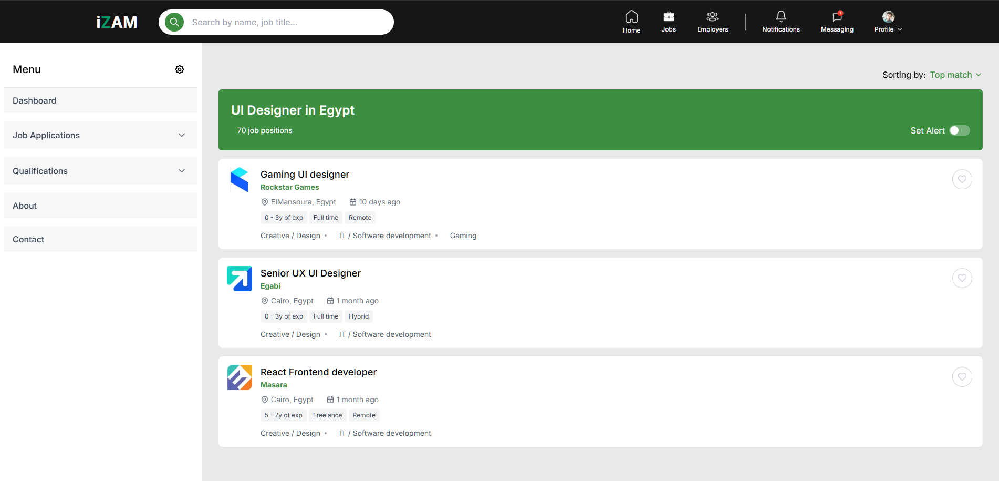

# Talentat Mini Website


## 🚀 Tech Stack

- Frontend: Next.js
- Backend: Node.js, Express.js

## 📁 Project Structure

```
talentat/
├── client/          # Frontend React application
└── server/          # Backend Node.js server
```

## 🛠️ Installation

1. Clone the repository:
```bash
git clone https://github.com/SalahShaalaan/talentat.git
```

2. Install Frontend Dependencies:
```bash
cd talentat/client && npm install
```

3. Install Backend Dependencies:
```bash
cd ../server && npm install
```

## 🚀 Development

Start the development servers:

1. Launch Backend Server:
```bash
cd server && npm run dev
```

2. Launch Frontend Development Server (in a new terminal):
```bash
cd client && npm run dev
```

## 🔧 Configuration

- Frontend runs on: `http://localhost:5173` (default Vite port)
- Backend runs on: `http://localhost:3000` (default Node port)

## 💻 Development Workflow

1. Backend changes should be made in the `server/` directory
2. Frontend changes should be made in the `client/` directory
3. Dont install any packages in the root directory, except for mutual dependencies

## 📝 Scripts

Client:
- `npm run dev`: Starts development server
- `npm run build`: Creates production build
- `npm run preview`: Preview production build

Server:
- `npm run dev`: Starts development server with nodemon
- `npm start`: Starts production server

